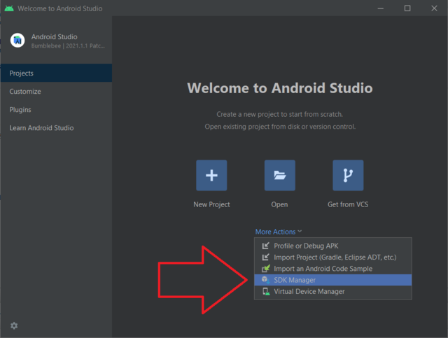
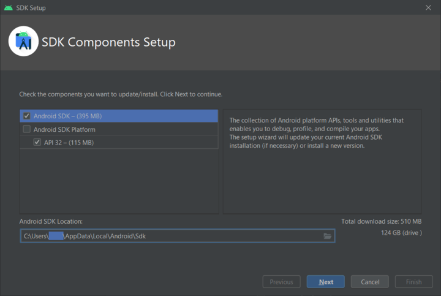
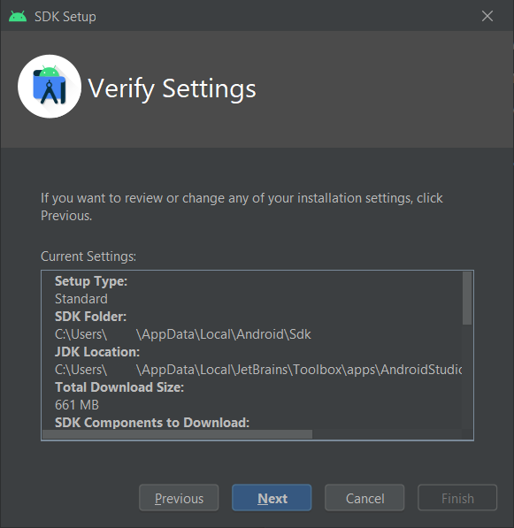
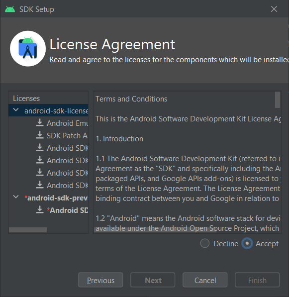
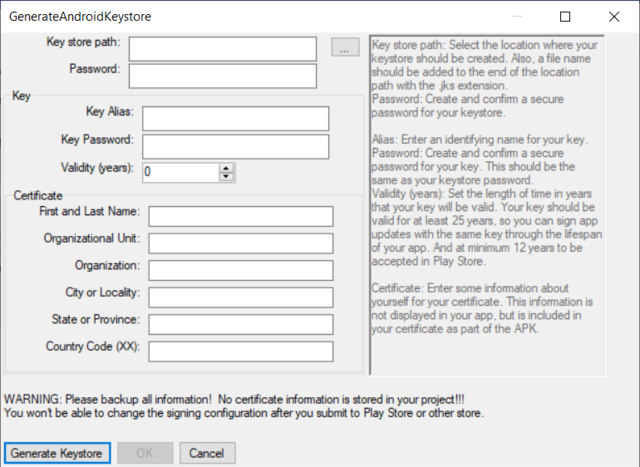

## Building for Android

It's now possible to compile for Android directly from the Editor, 
this section walks through what it entails.

### Installation requirements for Android in AGS Editor

AGS Editor requires Android SDK, Java and additional tools to work.
The supported way to set your development environment is to install Android Studio.

---

1. After installing Android Studio, load Android Studio and in the "more Actions" menu, 
select SDK Manager. If you already loaded a project, instead go into Tools, and then hit SDK Manager.

2. In the Android SDK screen, at top, hit Edit to set a desired Android SDK Location if needed, 
this is usually something like `C:\Users\USERNAME\AppData\Local\Android\Sdk`. 

   AGS requires SDK 29, select it and click OK. 
   If instead you have only the latest API automatically selected here, it's alright.
   
   In newer versions of Android Studio, for the command-line sdkmanager used by AGS Editor, you need
   also to select SDK Tools, and select "Android SDK Command-line Tools" for installation.

3. Hit next again.

4. In this screen, note down that  
   - the SDK Folder here is what is set as ANDROID_HOME in the Editor preferences, 
   - the JDK Location is the JAVA_HOME on the Editor preferences.
 
   You can just hit next now

5. And then it comes one thing you have to do, if you want to use it, you need to accept the licenses! 
   There are two licenses you need to accept in this screen, so scroll down and hit accept, 
   switch to the next one, scroll down again, and hit accept again.

   We are going to be using SDK 29 in here for now, so if something complains about it, 
   make sure to comeback to the SDK managed and find and click in Android 10 (Q), 
   API Level 29 and then proceed to installing it. 

   If you don't, AGS Editor may try to download and install it anyway if needed when 
   building your app for the first time, after ANDROID_HOME and JAVA_HOME are correctly set!

### Configuring the AGS Editor for Android Build

You are going to need now to configure the AGS Editor, with it loaded, go into File, Preferences...

Once the Editor Preferences menu is open, go into the Android tab. 
Here you will be able to set your JDK Path and SDK Path, which you noted down in step 4 before,
right after installing Android Studio. Once these are correctly set, 
a small message "Found On Config!" will appear for both.

Only **after** both are correctly set, you can now set your keystore information.
If you don't set, you will get an error saying "validateSigningRelease FAILED" when attempting to build your app.
If you don't have a Keystore, please generate one using the Generate Keystore button, 
and click OK after successfully generating one.

### Android App icons

At your project root, create a directory named icons with a directory named android inside.
Then you need to add the following files:

- `icons/android/mipmap-mdpi/ic_launcher.png` **48x48 pixels**, RGBA png icon
- `icons/android/mipmap-hdpi/ic_launcher.png` **72x72 pixels**, RGBA png icon
- `icons/android/mipmap-xhdpi/ic_launcher.png` **96x96 pixels**, RGBA png icon
- `icons/android/mipmap-xxhdpi/ic_launcher.png` **144x144 pixels**, RGBA png icon
- `icons/android/mipmap-xxxhdpi/ic_launcher.png` **192x192 pixels**, RGBA png icon

If you want to support round icons, additionally create `ic_launcher_round.png` files in the same directories.

### Building the App

In the Editor, go in General Settings, and in the Android category, adjust the settings for your game.
Then, in the Compiler category, under **Build target platforms**, tick the Android platform.

Now, in the Build menu on top, select Build EXE, or hit f7. 
A prompt will open, and once it's completed, the app will be in your game project directory under `Compiled/Android` folder.

