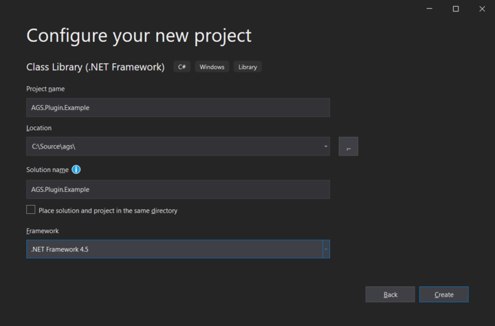
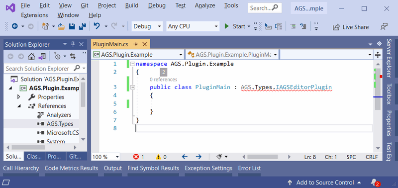
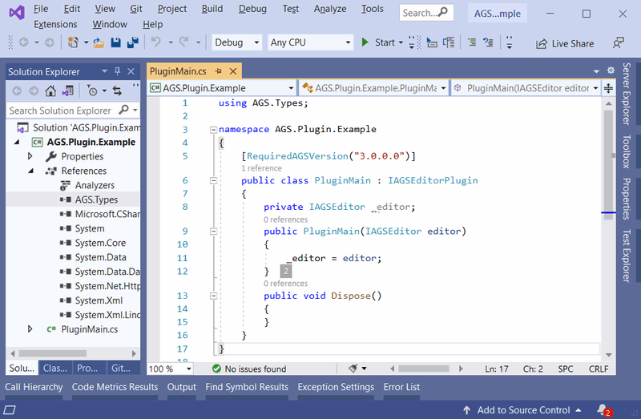

## Editor Plugins

AGS allows external utilities to enhance the Editor's functionality by the use of .NET plugins. These plugins can be written in any .NET language including C#, VB.NET, Visual C++ .NET and more.

 Note that .NET plugins are only supported for enhancing the editor functionality. Any plugins which need to be included with the game at run-time must be written with as plain DLLs using the Plugin API.

**NOTE:** .NET plugins require AGS 3.0 or later. They are not supported by AGS 2, and replace the old COM-based editor plugin API from AGS 2.x which is no longer supported.

Firstly, I'll explain very briefly what is required of an AGS plugin, for people who are already familiar with .NET. Then, I'll walk you through creating one with C#.

### Plugin Requirements

* The AGS Editor scans through its folder when it starts up, for all files `AGS.Plugin.*.dll`. Therefore, your plugin's file name must start with "AGS.Plugin." . Place it in the AGS Editor folder.
* Add a reference to the `AGS.Types.dll` file from the main AGS folder. This will import all the types you need for your plugin.
You must have one class in your plugin that implements the `AGS.Types.IAGSEditorPlugin` interface. It must have a constructor that takes one argument, an `AGS.Types.IAGSEditor` object. It must also have a `RequiredAGSVersion` attribute on the class, set to the minimum version of AGS that the plugin requires.
* The editor will find your class and construct it, passing in the *IAGSEditor* object that you can use to access editor methods. You have access to various parts of game data, but **be very careful if you change anything**. AGS makes certain assumptions about the data, in particular the ID's of items, so don't add or remove things unless you're sure about what you're doing.
* You work with AGS using *Components*. A component represents one area of functionality, so your plugin may well only need a single component. This class should implement the `AGS.Types.IEditorComponent` interface. Within the component's constructor you should do the work to add tree items, menu options, etc. See the plugin sample for an example.

Sample code for a plugin is [available to download](https://www.adventuregamestudio.co.uk/AGS.Plugin.Sample.zip). Note that you may need to remove and re-add the reference to AGS.Types after opening the project.

### Creating a plugin with Visual C#

The following tutorial will walk you through creating a plugin with Visual C#. I'll be using Visual Studio 2005 in this tutorial, but the further versions should likely work very similarly.

Start up Visual Studio, and select to create a new project (File, New, Project). In the "New project" window which appears, make sure "Visual C#" is selected in the left hand list, and then choose "Class Library" on the right. Type a name that starts with *AGS.Plugin*. for example I'm going to use `AGS.Plugin.TestPlugin`:

__

Now, we need to add a class that will be created when the plugin is loaded. Choose "Add Class" from the Project menu, and give it a name. This will be the main plugin class, so I'm going to call mine "PluginMain".

Next, we need access to the AGS libraries. Choose "Add Reference" from the Project menu. Go to the Browse tab, and find the directory where you installed AGS. There, you should find a file called "AGS.Types.dll". Add a reference to this file.

Visual Studio has given us a pretty bare class file. We need to make a couple of adjustments. First, add "public" to the class definition so that AGS can find it. Second, we need to tell AGS that this is our main class. We do this by making it implement the *IAGSEditorPlugin* interface, so add that to the class definition too:

__

There's one other requirement for our main class. We need to add a *RequiredAGSVersion* attribute to the class, defining what the minimum version of AGS is that our plugin needs. You can just set it to "3.0.0.0" if your plugin works with the basic editor functionality, but if you use any new features added in later versions then you'll need to change the version number to match.

The next thing we need is a constructor so that our class can be created. AGS requires it to have one parameter, of the type *IAGSEditor*. This will be the main object that we will use to communicate with the editor, so we'll save a copy in a member variable for future reference:

__

### Components

Ok, so the basic plugin class is written. If you want, you can compile it and copy the DLL to the AGS folder; but if you do so, you won't notice any difference in the editor. That's because it doesn't actually do anything yet.

The AGS Editor works with classes called *Components*. A component deals with one area of functionality -- for example, AGS contains a Characters component, a Fonts component, and so on. Your plugin will need to provide its own component for whatever type of functionality you're providing. In this example I'm going to call it *MathsComponent* because it's going to do some very complex logic!

Create a new class in the project, and name it appropriately. Make it public, and this time it needs to implement the *IEditorComponent* interface. Do this, and allow Visual Studio to automatically create the members for you.

Create a constructor for the component, and you'll probably want it to take in the *IAGSEditor* object. Then, construct the component from within the main plugin constructor that we wrote earlier. The component should create any menu items and project tree entries that it needs.

For now, that's the end of this tutorial. For more information, please [download and take a look at the sample code](https://www.adventuregamestudio.co.uk/AGS.Plugin.Sample.zip).
