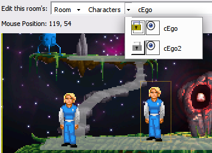

## Room Editor

The Room Editor is where the user can define the Room name, set a background,
create objects, add hotspots, define the walkable areas for the characters, mark
areas as walkbehinds, change lighting using regions, and more, for a Room. Only
one room can be edited at the same time.

### Background

By selecting a background on the `Display Background` combo box, you can select
which background of a room to display: Main Background, frame 2, 3, 4, 5. With
one background selected, click `Change...` button to change the background. If a
background of different size than the previous background is selected, all masks
(hotspot, walkbehind, region and walkable) are erased. If a room has more than
one background, by default, they are animated.

### Edit this room's control

This control allows you to view characters,objects and edges, simultaneously
with one of the room masks: hotspots, walkable areas, walk-behinds or regions.
Moving a character or object already in the room is as simple as clicking and
dragging it.

You can select any element in the room by navigating on the bar using the down
arrows, which will reveal the available elements on the chosen category.

Characters, objects can also be select on the room area by clicking on them.
To move edges directly on room area, first select the edges layer, and then you
will also be able to directly manipulate edges shown in the room area.
To select any room mask type of layer, first select the layer you are interested
and later use the Select area tool (picker icon on toolbar) to pick the specific
element.

**Placing a new object**

If you want to place a new object, you need to select Objects in the layer menu
and right click on the screen where to put the new object and click on "Place
New Object Here".

**Placing a character**

For placing a character not in the room, on it, you need to select the character
in the characters tree on Explore Project, and change it's `StartingRoom`
property to the current room being edited.

**Layer and element Visibility (eye icon)**

Each layer can be made visible/hidden by the push of a button. In addition, for
the objects/characters/edges layers each element in the layer can also be made
visible/hidden by the push of a button.
*This will only affect the editor, not the actual game*.

**Layer and element Locking (padlock icon)**

Each layer can be locked/unlocked by the push of a button. In addition, for each
layer, each element in the layer can also be locked/unlocked by the push of a
button.
A locked element cannot be moved until it is unlocked, useful to prevent
mistakes when designing the room.
*This will only affect the editor, not the actual game*.

### Properties control

The properties control will adapt to which element is selected at the specific
layer. If no element is selected or the edges layer is selected, this control
will show the current Room properties and events.

The list button switches the tree to show **Properties** and the lighting bolt
switches the tree to show **Events**. Both can be navigated either in categorical
order or alphabetical order.

Positional changes on the properties of an element, say it's (x,y) position,
will instantly be updated in the room area, which is useful for pixel
positioning things.

### Edges

Edges are draggable by clicking and holding on them, once their layer is
selected. If no edges are shown, you may need to look into the properties of
your room and place valid values on the BottomEdgeY, LeftEdgeX, RightEdgeX and
TopEdgeY properties of your room.

### Objects

Right click on the room and click `Place New Object Here` to create a new object.
They can be freely positioned in the room, and when one object is selected you
can edit it's properties on the Properties control. While dragging an Object
it's (x,y) position will be shown on screen, which refers to an object sprite
bottom left corner. Locked objects can't be moved.

### Characters

You need to place the characters on the room first by using the Character Editor.
While dragging an Character it's (x,y) position will be shown on screen, which
refers to an the current character sprite bottom middle position, similar to a
characters foot. Locked characters can't be moved.

### Room masks (Hotspot, Walkable areas, Walk-behinds and Regions)

AGS offers a simple editor when one of these layers is selected so that you can
directly edit these masks in the room area offering a picker, a line tool, a
freehand tool, a rectangle tool, and a fill area.

Also available is a way to both export the a mask layer as a bitmap and import
a mask layer. These are offered in case you prefer to draw those in your
preferred image editor, just make sure that you keep the exported 8-bit indexed
color palette.

See Also: [Room](Room)
