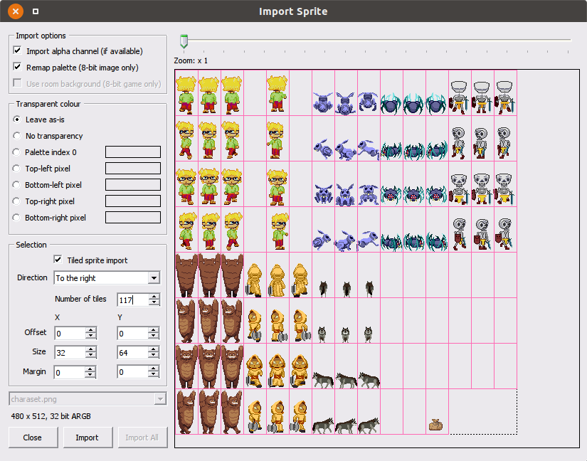

## Sprite Manager

The sprite manager is where you can import sprites and organize them into
folders. Each sprite that is imported will be assigned a sprite number which is
used as its unique identifier.

The sprite manager has two panes, on the left are the sprite folders. Right
click here to create a subfolder, rename an existing subfolder, or delete a
subfolder (losing all of its contents).

The pane on the right, is where imported sprites are displayed. Right clicking
on an empty area will give you the possibility to "import new sprite(s) from
files...". This allows you to import one or more compatible image files into
your game project.

**NOTE:** Unlike other game development tools, once a sprite is imported using
AGS it is added to the sprite data inside your game project's directory and the
source file isn't read again unless you choose to re-import it. This is done by
right clicking a sprite and choosing the "Replace sprite(s) from source..."
option.

**NOTE:** You can quickly select all files in a folder by selecting the first
file and then pressing Shift+End.

### Import Sprite

Once a file or files are selected, AGS will bring up the Import Sprite window.

In this window, AGS will offer you controls which determine exactly how the
images files will be used. The most crucial choice is usually to choose how
transparency will be determined for the imported sprite, as well as whether to
import the entire sprite or use a tiled selection.

If multiple files are being imported they can be processed individually by
using the 'Import' button, or all in one go by using the 'Import All' button.
The combobox near the bottom left corner of the screen will allow you to change
which source image file is currently being displayed.

**NOTE:** if using the 'Import All' button all remaining images will be imported
using the currently selected import options

**NOTE:** animated GIF frames are treated as separate images, so a 5 frame GIF
imported as 2 tiles will result in 10 new sprites being created.
