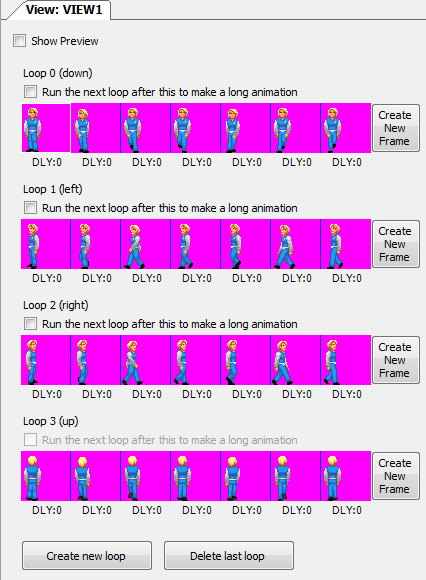

## View Editor

### Views

In the view editor you add sprites from the [Sprite Manager](EditorSprite) to animation strips called _Loops_. This way you create the walkcycles for your [Character](EditorCharacter) as well as all other character animations. Also you define the animation for object on screen you want to animate with _Loops_ inside a _View_.

You can have 4 or 8 Loops for different directions for walking views. This means your character can either walk left, right, up and down with 4 Loops or you add 4 additional directional walkcycles for diagonal movement. Usually 4 directions are more than enough to animate but no one is stopping you from going all the way. You set the 4/8 directions walking animation per character in the [Character Editor](EditorCharacter).
Animation flipping is also possible but for that see the [Right Click Context Menu](EditorView#right-click-context-menu) entry.

It is good practice to use a new loop for every character and also for special character animations.  
You can add a lot of object animations to one single view, but you could for example sort them by game chapters (one view for every chapter) to make it easier for you to find them again. You can **name the View** with a right-click on the View in the game explorer.

Don't worry about overloading AGS, with the newer versions you can have unlimited views, unlimited loops per view and unlimited frames per loop.

### Right Click Context Menu

When you right-click on a single frame in a loop you get the following options:

- _Flip frame_

  Flips a single frame.

- _Delete frame_

  Remove that single frame

- _Insert frame before this_

  Useful when you added your animation and forgot first frame was the idle frame.

- _Insert frame after this_

  Inserts a frame after the one you right clicked.

- _Cut loop_

  Good for moving things around when you did everything right in the wrong loop.

- _Copy loop_

  Copies an entire loop!

- _Paste over this loop_

  You need this to place the loop after you copied it.

- _Paste over this loop flipped_

  If you have copied the loop with the character going right, make him go to left!

- _Flip all frames in loop_

  You already did the character going right and pasted on this loop, then use this option!

- _Add all sprites from folder_

  On the sprite manager, if you have all the sprites to be used in a loop, ordered, in a folder, you can use this option to quickly added them. This is useful when you have many frames.

### Show Preview

When you tick the checkbox above the Loops called **Show Preview** you get to see a preview of the animation of course. It is located to the left of the list of Loops and you can either manually browse through all the frames of the Loop or you check the **animate** checkbox to see it in motion.

The **Skip Frame 0 (standing Frame)** Checkbox does exactly that, it skips Frame 0 for the preview animation. This is only important for previews for views that are used as walking views for a character.  
When you animate a [game object](Object#animate) or you want the [character to animate](Character#animate) different from walking (like picking up an [Inventory Item](EditorInventoryItems)) Frame 0 is always included in the animation. When the view is used as a walking view Frame 0 is skipped for the animation until the character reaches the endpoint of the walk and stops there. Then Frame 0 is displayed all the time in the direction the character is facing when he stopped walking.  

### Properties

_Delay_  
With the delay setting you delay the displaytime of the one selected _frame_ only by that amount. This delay is in game frames, so, how long the delay is in time depends on the frames per second your game is running on. You can check the gamespeed for easy debugging with [Game.GetGameSpeed](Game#getgamespeed). In your start function you can even set the FPS with [Game.SetGameSpeed](Game#setgamespeed). By default AGS games run at 40 FPS. This delay value is specific to one frame only. And you can slow down the whole animation with the Delay value of the [Animate](Object#animate) function. This frame delay is added to the overall loop delay.

_Flipped_  
You flip that one frame with that property. Very useful for mirrored animations like in walkcycles for left and right walk. Don't have a character with a cane then. Please note you can also flip the whole loop and not only a single frame within the [Right Click Context Menu](EditorView#right-click-context-menu).

_Image_  
The image number AGS gives your image imported into the [Sprite Manager](EditorSprite). This selected frame has exactly this image number.

_ID_  
Greyed out. Should be the frame number for the selected frame.

_Sound_  
Play the sound set here every time the animation loop plays and reaches this frame.  
Useful for footsteps and all other sounds needed for object animations.
