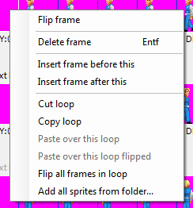
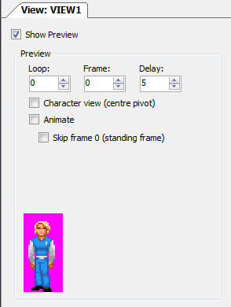
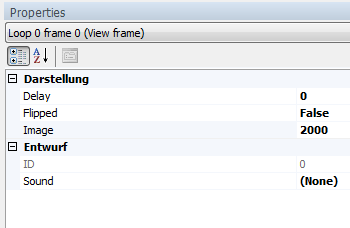

## View Editor

### Views

In the view editor you add sprites from the [Sprite Manager](EditorSprite) to animation strips called _Loops_. This is the way that you create the walkcycles for your [Characters](EditorCharacter) as well as all other in-game animations.

For walking views you will typically have 4 or 8 Loops, to represent the different directions for walking in. If your character will only be walking left, right, up, and down , then you probably just want 4 Loops. If a character needs separate animations for diagonal movement then you might need 8 Loops. You assign the 4 or 8 walking animations per character in the [Character Editor](EditorCharacter).

It is good practice to use a new loop for every character and also for special character animations. For object animations, you could add a lot of animation Loops to one single View - sometimes this can be useful for organisation purposes (e.g. one Object animation View for every chapter of your game). You can name the View by right-clicking it in the project explorer.

Newer versions of AGS can have unlimited Views, unlimited Loops per view and unlimited Frames per loop. Still, there is some overhead with the way the AGS Editor previews them, so when you have a lot of large Frames you should consider using a new View for each animation.

### Right Click Context Menu

When you right-click on a single frame in a loop you get the following options:

- _Flip frame_

  Flips a single frame.

- _Delete frame_

  Remove that single frame

- _Insert frame before this_

  Useful when you added your animation but forgot that first frame is the idle frame.

- _Insert frame after this_

  Inserts a frame after the one you right clicked.

- _Cut loop_

  Good for moving things around when you did everything right but in the wrong loop.

- _Copy loop_

  Copies an entire loop!

- _Paste over this loop_

  You need this to place the loop after you cut or copied it.

- _Paste over this loop flipped_

  If you have copied the loop with the character going right, this will make him go to left!

- _Flip all frames in loop_

  You already did the character going right and copied this loop and want to flip the sprites in the whole loop, then use this option! This is a good timesaver.

- _Add all sprites from folder_

  Put all the sprites to be used in a loop, in a folder in the sprite manager, ordered (probably with a consecutive number sequence at the end), then you can use this option to quickly add all image files from that folder to the loop in the order they are in the folder. This is useful when you have many frames for a loop.

### Show Preview

When you tick the checkbox above the Loops called **Show Preview** you will see an extra panel appear where the animation can be previewed. You can either manually browse through all the frames of the Loop or you check the **animate** checkbox to see it in motion.

The **Skip Frame 0 (standing Frame)** checkbox does exactly that, it skips Frame 0 for the preview animation. This is only important for previews of views that are used as walking views for a character.

When you animate a [game object](Object#objectanimate) or you want the [character to animate](Character#characteranimate) for something other than walking (like picking up an [Inventory Item](EditorInventoryItems)) Frame 0 is always included in the animation. When the view is used as a walking view Frame 0 is skipped for the animation until the character reaches the endpoint of the walk and stops there. Then Frame 0 is displayed for the direction that the character is currently facing.

### Properties

_Delay_  
With the delay setting you delay the displaytime of the selected _frame_ by a set amount. This delay is in game frames, so how long the delay is in time depends on how many frames per second your game is running at. You can check the game-speed with the [GetGameSpeed](Globalfunctions_General#getgamespeed) function. By default AGS games run at 40 FPS, but this can be configured by setting the desired frame rate using the [SetGameSpeed](Globalfunctions_General#setgamespeed) function. This delay value is specific to this single frame only. To add delay to an entire animation, use the delay parameter of the [Animate](Object#objectanimate) function instead. This frame delay is added to the overall loop delay.

_Flipped_  
You can flip a single frame with this property. This is very useful for mirrored animations, such as walkcycles, where a flipped version of the walk-left animation and be used to walk right, for example. Note that instead of flipping just a single frame you can also flip the whole loop by using the  [Right Click Context Menu](EditorView#right-click-context-menu).

_Image_  
The sprite number for this frame's image, as displayed in the [Sprite Manager](EditorSprite).

_ID_  
The will display the frame number within the loop, for the selected frame. This value is not directly editable.

_Sound_  
Play a sound when this frame is displayed. This is typically used to add footsteps to character walkcycles.
