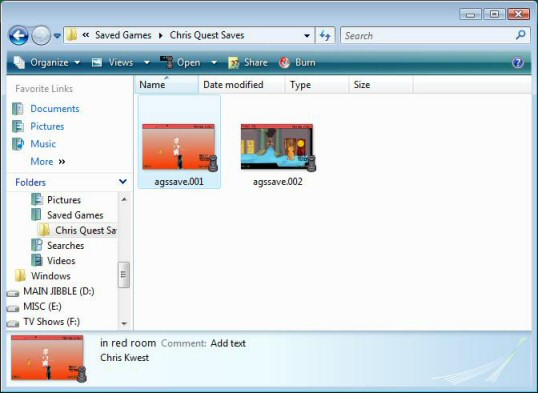
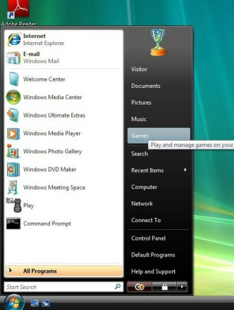
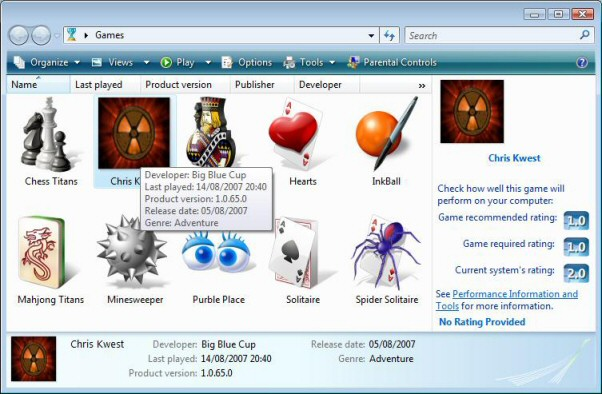

## Integration with Windows

AGS has the ability to integrate with Windows in two ways. Firstly, it
can be set up to launch save games directly from explorer when the
player double-clicks them; and secondly, in Windows Vista and later, AGS
can integrate with the Game Explorer feature.

---

### Enhanced Save Games

Optionally, AGS can set up Windows Explorer so that you can double-click
on a save game file to directly launch the game and continue from where
you left off.

**Setting it up**

In order to enable this, open the General Settings pane, and look for
the "Saved Games" section. Here, there is an option called "Enhanced
Save Games". If you switch this on, then AGS will enable the integration
with Windows Explorer.

To make this work, you need to set the Save Game File Extension setting
to a file extension. This is how Windows will identify the save game
files, and you must supply an extension of between 5 and 20 characters
in length ("DemoQuestSave" would be an appropriate extension for Demo
Quest, for example).

By changing these settings, your game's saved game filenames will
change, and therefore you will lose access to any existing saved games.

**Extra features for Windows Vista and later**

If the player is running Windows Vista or later versions, then this
feature will also allow them to see the save game description and
screenshot (if enabled) in the Explorer preview window:

**Enabling the integration**

Once you've built the game, the integration won't be enabled
immediately. If you want to use this feature, you'll need to distribute
your game in an installer rather than a zip file, because there's an
extra step you need to run after installation to set up the association.

In your installer, you need to run the game executable with the special
parameter `-registergame`. When you do this, AGS will create the
necessary associations in Explorer to get the feature working. If it is
successful, it will not display any messages.

You can manually test this by creating a shortcut to your game EXE file,
and modifying it to add `-registergame` to the end of the command line.
Then, run the shorcut and the associations should be created for you.

For un-installing, run the game EXE again but with the `-unregistergame`
parameter. This will cause AGS to remove the associations from the
player's system.

---

### Windows Game Explorer

Windows Vista and later versions have a feature called the Game
Explorer, which is a special folder on the Start Menu that lists all the
games installed on the user's system and provides easy shortcuts to play
them.

AGS is now able to add your games to this list. However, in order to do
so you would need to distribute your game using an installer rather than
just in a plain zip file, since you need to tell AGS to add the game to
the list at install-time.

**Enabling Game Explorer support**

Open the General Settings pane in the editor. If you scroll down to the
bottom of the list, you'll find a section titled "Windows Game
Explorer". The main setting is called "Enable Game Explorer
integration", and is disabled by default. Set this to True if you want
to be able to add your game to the Game Explorer (it will have no effect
on Windows XP and earlier versions).

**Game Explorer settings**

The rest of the settings here allow you to set up various fields that
the Game Explorer can display. **Developer Website** must be a URL
starting with `http://` if you fill it in, and **Version** must be a
four-point version number (eg. 1.0.0.0).

The **Windows Experience Index** is a score that Windows gives each
computer depending on its game-playing prowess. 1 is the lowest score,
and 5 is the highest at present. This field allows you to specify the
minimum score required to play your game (this will usually be 1 for AGS
games, unless you have high resolution and lots of animation).

**Save games**

If you set the *Save games folder name* property in the Saved Games
section, then the Game Explorer will provide a right-click option to go
straight to the save game folder. This is only useful if you also enable
Enhanced Save Games.

**Parental controls**

AGS is not currently able to support the Windows Parental Controls, due
to Windows requiring the game to be digitally signed for this to work.
Digital signatures require you to buy a certificate from an authority
such as Verisign, so at present they are not supported. Your game will
be classed as "Unrated" by Windows.

**Boxart image**

The Game Explorer can display a high-resolution alpha-blended image for
your game, rather than the standard game icon. To utilise this, place a
file called `GameExplorer.png` in your game folder, and rebuild the game
EXE. This must be a PNG image, no larger than 256 x 256 pixels:

**Adding the game to the Game Explorer**

In order to actually add the game to the Game Explorer's list, you need
to run the game executable with the special parameter `-registergame`
When you do this, AGS will add the game to the Game Explorer and exit.
If it is successful, it will not display any messages.

Therefore, as part of your installer, once the game files are all
installed you should add a step at the end to run the game EXE file with
this parameter. It will do nothing on Windows XP and earlier versions.

For un-installing, run the game EXE again but with a `-unregistergame`
parameter. This will cause AGS to remove the game from the Game
Explorer's list.

NOTE: If you have both Enhanced Save Games and Game Explorer
Integration enabled, then the `-registergame` and `-unregistergame`
commands will register/unregister both.
