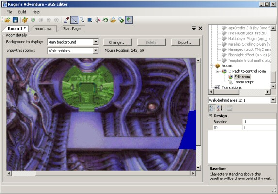
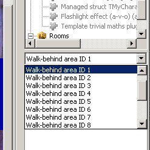

**Getting Started with AGS - Part 2** {#getting-started-with-ags---part-2 align="center"}
-------------------------------------

In AGS, games are made up of several *rooms*, which the player moves
between in order to play the game. Each room is one screen that has its
own background, hotspots and objects.

### Creating your first room

Scroll down to the bottom of the project tree, and you'll see a node
called "Rooms". Right-click it, and choose "New room". You'll see a "1:"
node appear underneath. This shows us that we've created room number 1,
and we can give it a name in a moment.

{width="234" height="160"}\
*The Rooms list in the project tree*

Expand the "1:" node, and double-click the "Edit room" node underneath
to open the room. You'll see a new window open up, with a big black area
in it. This is the room background, which is currently blank. The room
editor looks like this:

{width="518" height="384"}\
*The Rooms list in the project tree*

There are four main parts to this window:

-   The *Background Selection* area allows you to import and manage the
    room's backgrounds.
-   The *Room Parts* drop-down list is the way that you switch between
    seeing different aspects of the room.
-   The *Room Background Preview* area is where you see the room's
    background image, along with various things on top of it, depending
    on what's selected in the Room Parts option.
-   The *Properties* window allows you to set up various properties and
    events for the room.

**Naming the Room**

As a first step, let's give the room a description. This is just to help
us easily remember which room it is, and this description isn't used at
all by the game engine. Click in the "Description" property in the
property grid, and type in something appropriate. You'll notice that the
project tree updates to include this description.

**The Background**

Now, the first thing you need to do is draw the background for the room.
This needs to be an image of at least the same size as your game
resolution (that we set earlier on the General Settings pane); if it's
bigger than the game resolution then it'll become a scrolling room.

Draw the image in your favourite paint package, and once done, save it
as a BMP or PNG file. Then, return to the AGS Editor, and press the
"Change" button. Find the file you just created, and click Open.

You should see the black area in the editor replaced by your image. For
this tutorial, I'm going to shamelessly steal a background from Space
Quest 4. Obviously, you should draw your own!

{width="491" height="343"}\
*I've imported my background*

**Edges**

Open up the combobox that says "Nothing" in it, and select "Edges".
You'll see four yellow lines drawn across your image in various places.
These are the room *edges,* and they define how far the character needs
to walk to be considered to have left the room. Click and drag them to
position them appropriately. Bear in mind that it's the character's
**feet** that are compared with these lines when positioning.

{width="573" height="400"}\
*I've lined up the top and right edges correctly *

At the moment, walking past the edge won't actually cause anything to
happen, but we'll deal with that later. In my example, the character can
only walk off the top and right edges, so they're the only ones that
I've dragged into position. I've left the others as they are, since we
won't be needing them.

**Walkable Areas**

Next, we need to define the room's *walkable areas*, which define where
characters are allowed to walk within the room. Open up the drop-down
list again, and select "Walkable areas":

{width="573" height="400"}\
*Walkable areas mode*

In the toolbar you'll notice that some new buttons have appeared. These
are the drawing tools, and work in a similar way to most paint packages.
AGS provides Line, Freehand, Rectangle and Fill tools. Alternatively,
you can draw your walkable area mask in a paint package and import it
(we'll cover that later).

What we need to do is to fill in the areas of the room where the player
is allowed to walk. In the game, the bottom middle of the character is
checked against these areas, so it's probably wise to make the walkable
areas slightly smaller than they need to be, to allow the character's
feet to spill outside the area.

The best way to start off is with the Line tool. Draw some lines to
encompass the area that you want to be walkable. Make sure they are all
joined up, and then choose the Fill tool and click in the middle of the
area, and it should be filled blue. If the whole screen goes blue, click
Undo, then use the Line tool to make sure all the edges of the area are
properly connected up, and try again.

You can use the right mouse button with the drawing tools to erase areas
in the same way that you use the left button to add them.

{width="573" height="400"}\
*I've drawn a walkable area where I want the player to be able to go.*

**Walk-behind areas**

The next job we need to do is to define the walk-behind areas. These
areas (called "priorities" by some other adventure game tools) tell the
game where the character needs to be drawn behind the background. For
example, on my screen here, the player needs to walk in from behind the
curved wall on the right.

Choose "Walk-behinds" from the combobox. Your walkable area will
disappear and you'll be back to just seeing the room background.

Now, we draw on the walk-behind area in the same way as we did the
walkable area - in fact, all the same drawing tools are available. My
result looks like this:

{width="573" height="400"}\
*The walk-behind area painted over the pillar*

Notice that I haven't bothered to make the whole of the pillar a
walk-behind from top to bottom - using my knowledge of the walkable
areas and the height of the character, I can just draw a walk-behind in
the places where it's possible for the character to be.

Now that we've done that, there's a very important next step in order to
make the area work - the **baseline**. The baseline is a horizontal
line, which tells the game where the character has to be in order to be
drawn behind the area. For example, if you had a table in the middle of
the room, you'd only want him drawn behind the table if he was standing
behind it.

You normally place a baseline at the lowest point of the walk-behind
area. Move the mouse cursor to the bottom of the walk-behind area, and
look at the "Mouse Position" display above the room background. These
are the X and Y co-ordinates of where the mouse cursor currently is.
We're only interested in the Y co-ordinate, so type it in to the
Baseline setting in the property grid.

By default, we've been drawing blue areas onto the screen. But what if
we had two pillars, in different places? We wouldn't want the same
baseline to apply to both. Never fear, AGS allows you to have several
different areas on each screen. Above the property grid, there's a
combobox that says "Walk-behind area ID 1". You can change this to draw
in another colour, and each area has its own baseline.

{width="247" height="247"}\
*Selecting a different walk-behind area*

**Trying out the game**

Ok, we've slogged away at making our room - now it's about time to give
it a go. Press F5, or click "Run" on the Build menu. This will save your
work and launch the game! Once loaded, you should see your room with the
character in it.\

---
  {width="32" height="32"}   When you use the Run command, the game will always run in a window. If you want to test the game full-screen, use the Ctrl+F5 ("Run without debugger") option.
---

Try to move the character around. If he won't move, he probably didn't
start on a walkable area. If this is the case, expand the "Characters"
node in the project tree, and double-click "cEgo". Then, look in the
property grid for two properties called "StartX" and "StartY". You can
find out what these co-ordinates should be by going back to your room
background, positioning the mouse cursor at the place where you want the
character to start, and reading the "Mouse co-ordinates" display.

Once you've got that working, have a play walking the character around
the screen, testing out the walkable and walk-behind areas.\

---
  {width="32" height="32"}   The normal way of exiting the game is to press Ctrl+Q. It's possible that during development of your game, you may create a script that causes the game to lock up - in this case, the emergency break key Alt+X will exit the game for you.
---

**Go to part 3:** [Adding interaction](acintro3)

Tutorial created 9 November 2002; updated 12 August 2007. Copyright (c)
2001-2002 Chris Jones.
