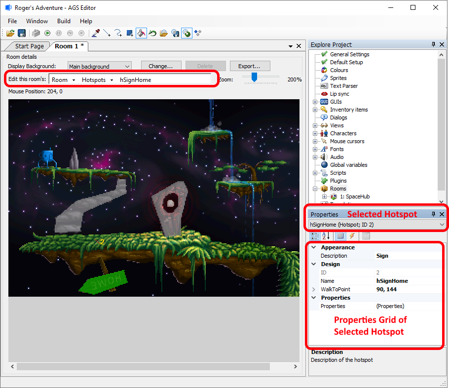
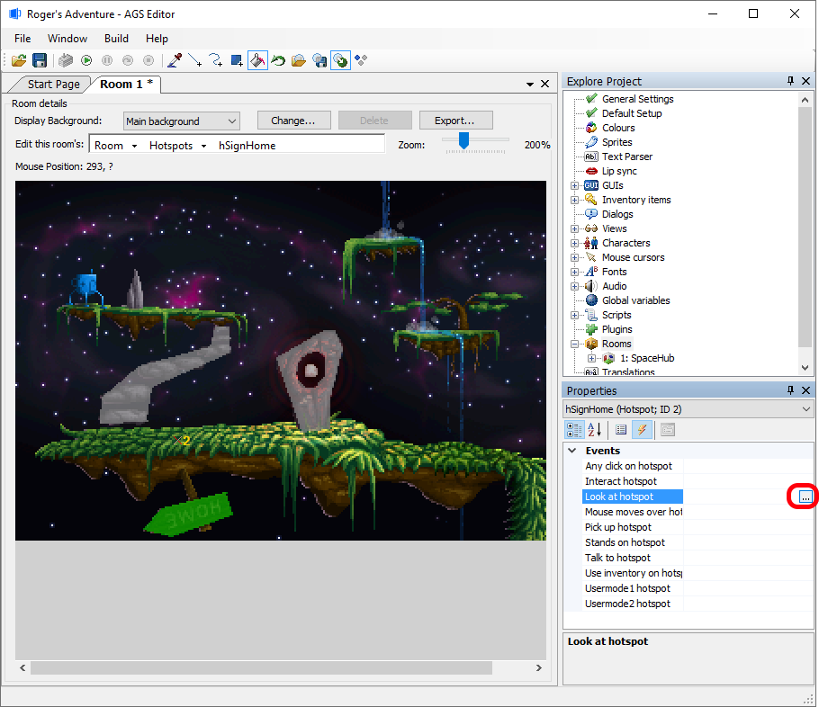
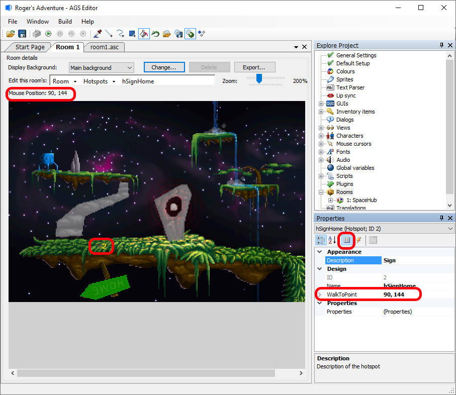
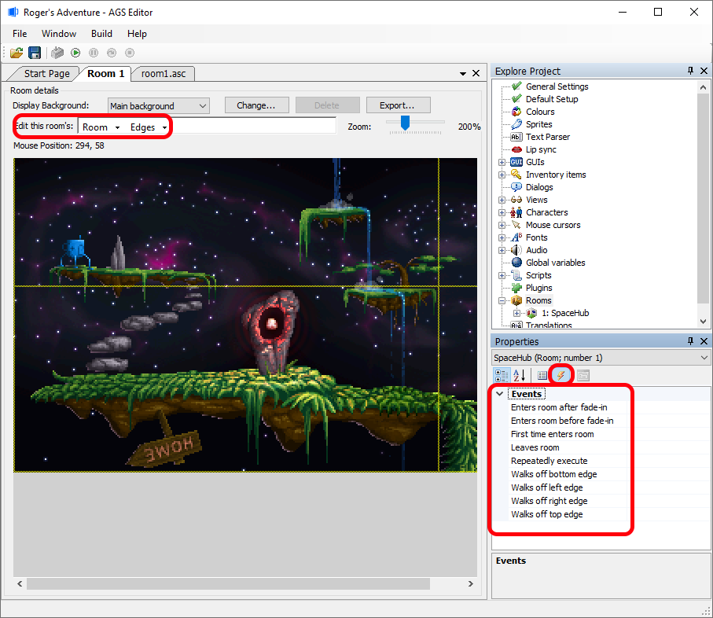

## Getting Started with AGS - Part 3

### Adding some interaction

OK, so we now have a working room. The player can walk around it as much
as they like. However, our game so far is pretty boring - the player
can't actually do anything of value yet!

AGS provides you with three types of things that the player can interact
with - *hotspots*, *objects* and *characters*:

-   A **hotspot** is an area of the background image that the player can
    look at and interact with. Hotspots are generally used for parts of
    the screen such as a tree or the grass which won't change as the
    game progresses.
-   An **object** is an item in the room that can move around the
    screen, and be switched on and off at will. Objects must stay within
    the room that they are created in.
-   A **character** is like an object, except that it can move between
    rooms and therefore appear all over the game. Characters also have
    special properties such as talking animations, inventory, and so forth, which
    means you will usually use one to represent each NPC
    (non-player character) in the game.

#### Hotspots

The easiest thing to start off with is hotspots. Make sure you've got
the room editor open, and select **"Hotspots"** from the "Room Parts" drop-down list box
(the same place where we selected "Walkable areas" earlier).

Hotspots are drawn in exactly the same way as walk-behind and walkable
areas. You'll probably want to use several different Hotspots for
different areas of the screen.

* If you are following this tutorial, then the first Hotspot is drawn for you, with a description of "Glowing Orb".

To create a second hotspot, change the "Selected Hotspot" to **"hHotspot2 (Hotspot; ID 2)"** using the Hotspot selection drop-down list above the Properties Grid -- OR -- by using the Room Parts drop-down and selecting the Hotspot text, and then the desired Hotspot, and you can now draw a second hotspot and it will appear in a different color than the first. For this tutorial, let's draw a hotspot over the wooden sign along the bottom of the background image. You may notice that all the other hotspots will be greyed out (See Note below).

Once you've drawn a hotspot, there are two Properties Grid fields to set for this hotspot:

-   **Appearance** -> **Description**. This sets a player-friendly name for
    the hotspot, which is vital if you are going to use a
    LucasArts-style interface where the player can move the mouse over
    the screen to see what's where. If you're using a Sierra-style
    interface then this name will never be displayed to the player, but
    it's useful to fill it in anyway for your own benefit. By default
    this is "Hotspot 1", "Hotspot 2", etc.

-   **Design** -> **Name** This is a name by which the hotspot can be
    referred to in the room script. This name cannot have any spaces or
    special characters -- just the letters *a* to *z*. The convention in
    AGS is to start the script names for hotspots with an *h*, for
    example *hDoor*. The name must be unique within the room.

 (**NOTE**: In the Room Background Preview editor, all the hotspots except the currently selected one are drawn in grey. This is to emphasize which hotspot you currently have selected
to edit. You can change this behavior by toggling the "Show non-selected
masks greyed out" button at the right-hand end of the AGS Editor toolbar.)

#### Interactions

Right, now it's time to make something happen! Make sure the second
hotspot is selected, and click the Events button:

You'll see that the property grid changes to list all the events for
this hotspot. Events occur when the player does certain things in the
game. At the moment, nothing is set to happen in response to any of the
events, so whatever the player does to the hotspot, they will get no
reply.

Right, let's start with something simple. When the player looks at my
hotspot, I want to display a message telling them what they can see.
Click on the "Look at hotspot" row, and a "..." button will appear.

Click the "..." button. This will create an entry in the script for this
event, and you'll find yourself taken to the script editor. If instead
you get a message telling you that the hotspot needs a name, read back
up for how to set a name for the hotspot, earlier in this article.

So, you are now in the script editor. It all looks a bit bare and
intimidating, but you should have something like this:

    // room script file
    
    function hSignHome_Look()
    {
      
    }

The "*function hSignHome_Look*" line defines that the script underneath
will be run when this event occurs. In AGS, the curly brackets **{** and **}**
are used to mark the start and end of a block of script. Anything that
you type in between them will be run as part of this event.

There's a separate [Scripting Tutorial](ScriptingTutorialPart1) giving you an introduction to the scripting
language, so I won't attempt to explain it here. But we can start with
something very simple, using the *Display* command, which displays a
message to the player. Type in something like this:

    // room script file
    
    function hSignHome_Look()
    {
      Display("The sign says 'EWOH'. I have no idea what that could mean.");
    }

Once you're done, you may want to "Save" your work on the Script Editor, and then click on the "Room 1" tab to return to the main room editor.

#### Walk-to points

OK, since we're back editing hotspots, click the let me quickly explain the
"Walk-to point" option in the Property Grid. This allows you to set a
position for each hotspot that the character will walk to whenever the
player interacts with the hotspot - just like the way the LucasArts
games like Monkey Island worked.

Select the "Properties" button on the Properties Grid. Hover your mouse over where you want the player to walk-to when interacting with the hotspot. Notice the "Mouse Position" of your cursor is given below the "Room Parts" drop-down. You'll now need to remember those coordinates and write them down in the Properties Grid -> WalkToPoint. When completed, you should see a marker at those coordinates referencing the hotspot. In this case a **"X 2"** marker is shown, indicating that HotSpot "2" has a walk-to point at that "X".

If you set a walk-to point, then whenever the player clicks interact or
talk on the hotspot, the main character will first walk to the walk-to
point before the relevant event is triggered. If you want, the character
can also walk there when the LOOK mode is used - this option is
configurable in the game General Settings pane.

 (**NOTE**: To remove a walk-to point, simply set it to 0,0.)

#### Edges revisited

OK, so we've covered the basics of creating a room. However, there's one
thing that we did a while back that we need to clear up - yes, the
edges.

Select "Edges" again in the list box. Now, click the Events button in
the property grid and this time we'll see the events for the room
itself. Among the events listed, you'll see "Walks off left edge",
"Walks off right edge", and so on. These are fired when the player
character crosses the edges that we defined back in part 2. We won't be doing this for this tutorial, but normally
you will use the *player.ChangeRoom* script command for these events, to take the player to a different room.

### Testing Your Work

Now, hit F5 to try out our latest additions! Make sure that when you
look at hotspot 2 the game displays the message that you typed into the
script and that the character walks to your walk-to point.

#### Scripting tutorial

Now might be a good time to check out the [Scripting Tutorial](ScriptingTutorialPart1) to get a
better understanding of what your script code is doing. Alternatively,
finish off this tutorial first and then check out the scripting
tutorial.

Next Chapter: [Part 4 - Objects and Inventory](acintro4)
