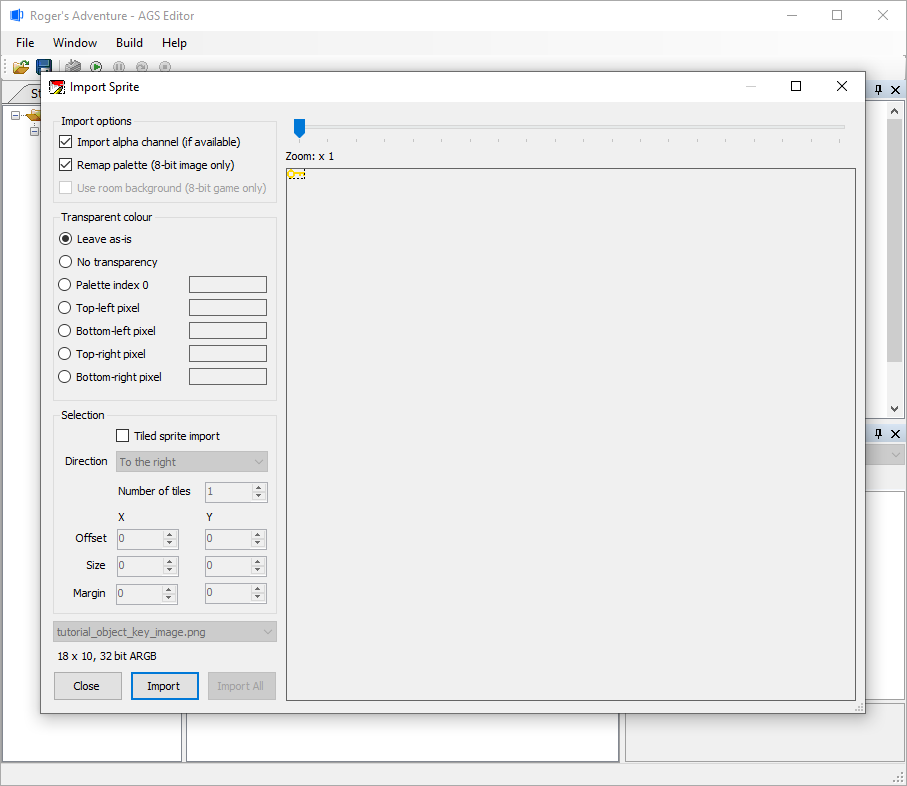
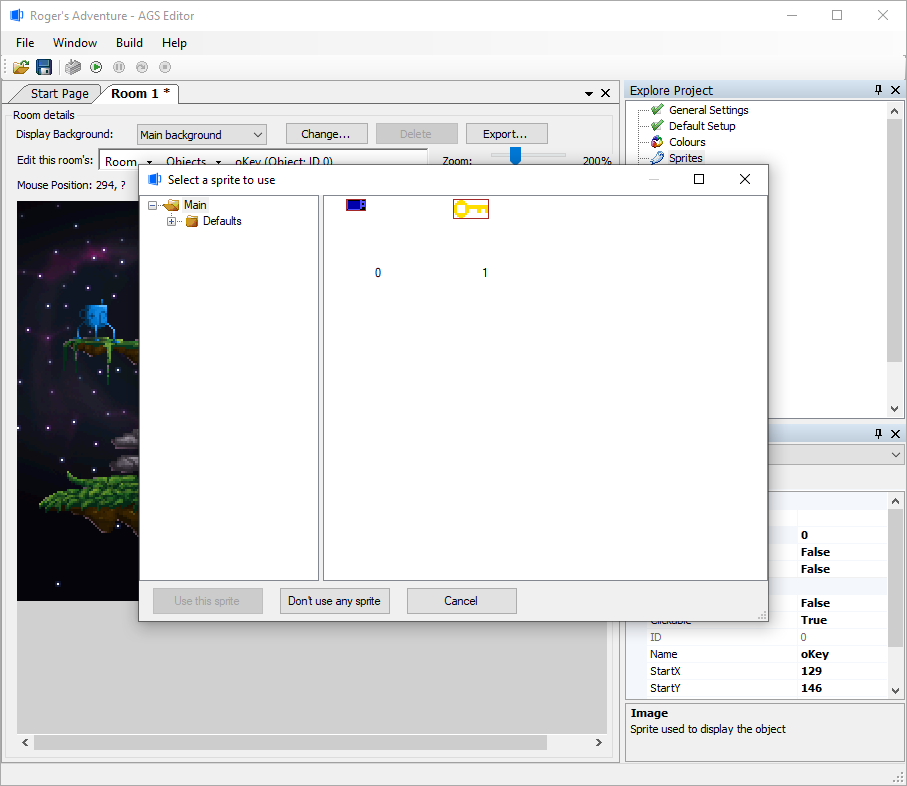
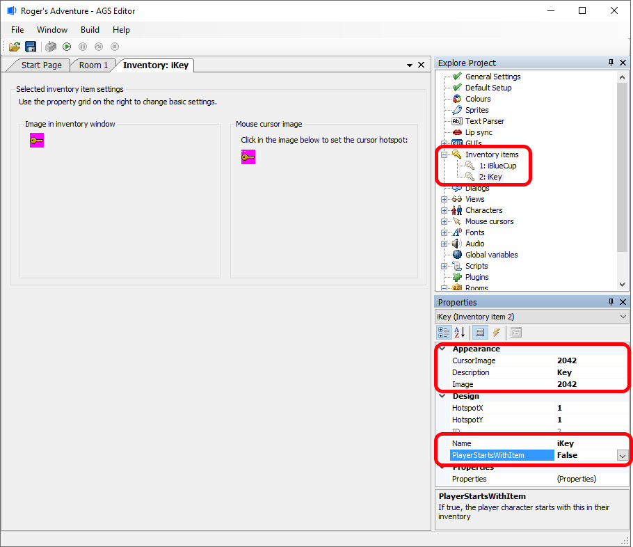
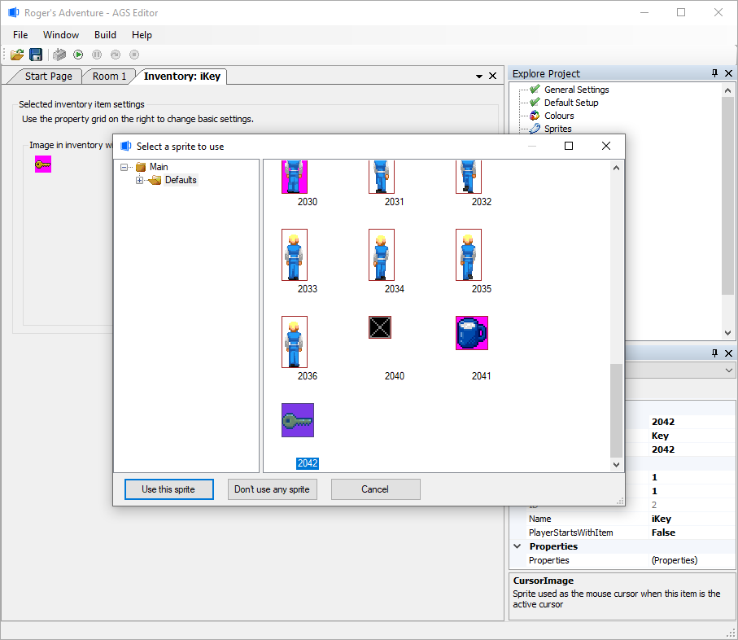
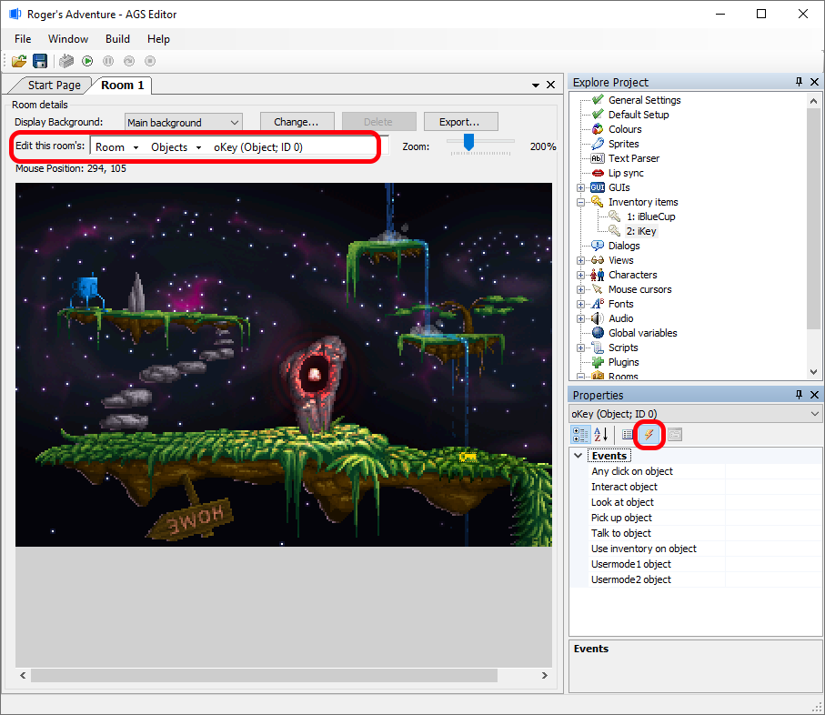
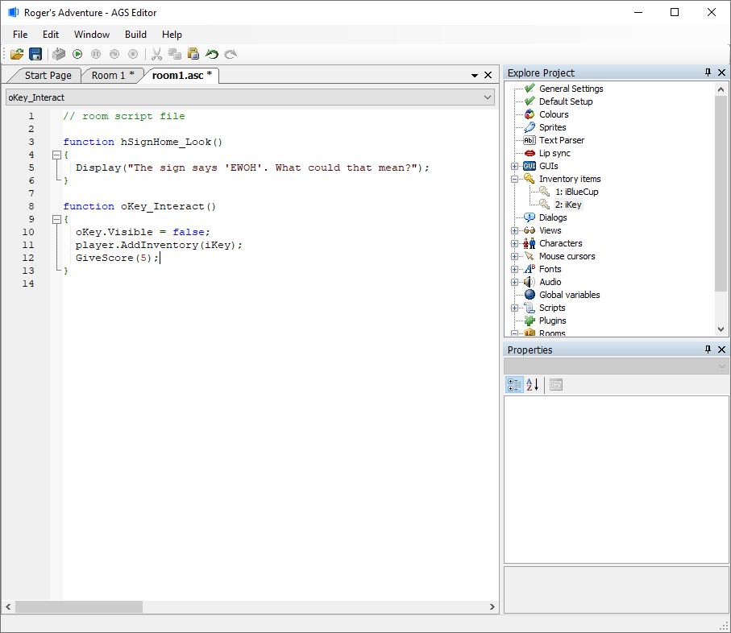

## Getting Started with AGS - Part 4

### Objects

Objects are items on the screen which, unlike hotspots, can move, change,
and disappear. You use objects for things in the room that the player
can take (since they can disappear), and for things which need to
animate.

So, let's revisit the age-old "key" inventory item. Let's say we will have
a locked door on another screen, and the player can pick up a key from this room to
open the door with. Please don't use this puzzle when you're making a proper
game, it's been done far too many times. ;-)

#### Import a Sprite

For this tutorial we will need to import a sprite of a key to be used later as an object on the background. Right-click on the following key image, save it to your computer, and we will import it into the Sprite Manager of the AGS Editor soon.

* 

Within the AGS Editor, choose "Sprites" from the Project Tree, in the upper-right of the editor. Making sure you have "Main" selected in the left-side tree, you should have a screen that look like this:v

Right-click to the right of the "blue cup" image # 0, and you should get a context window drop-down of actions. Choose **"Import new sprite(s) from files..."**. Navigate to where you saved the key image on your computer and select that image file. Next, you will see the "Import Sprite" window. The window should look like this:

Go ahead and select the "Import" button. You will now be able to see your new key graphic next to the blue cup graphic. It is now ready to be chosen as a graphic within your game.

Now that we've got our key sprite ready to be used, let's get back to discussing Objects.

From the same Room Parts drop-down list as we chose "Walkable areas" and "Hotspots" earlier,
let's return there and select **"Objects"**. Now, to add an object to the
room, simply right-click on the background where you want to add it, and
choose **"Place New Object Here"** from the menu which appears.

As if by magic, a blue cup appears! This is the default sprite in AGS,
and will appear anywhere that you haven't selected a proper image yet.
Notice that the Properties Grid has changed to display the details of this
new object -- one of which is a property called Image. Select this
property, and a "..." button appears.

Click the "..." button, and you'll be presented with the *Sprite
Manager*. We'll explain this in even more detail later, but basically it is
the focal point in AGS where you import and export all your graphics
except for room backgrounds. For this tutorial, ensure that the **"Main"** tree choice in the left-side tree is selected, and you should see your small key picture that we imported earlier. Double-click that **"Key"** image.

You should now see that the blue cup graphic has changed into a key. You can
move it around by left-clicking and dragging the sprite within the
background image. Place it somewhere sensible on your screen. I placed it further to the right of the walkable area.

The next thing we should do is give the object a name. Similar to what
we did with hotspots, since the object will be referred to in the script
it will need a name that we can call it by. Scroll down the Properties Grid
and find the **"Name"** property, and set it to something sensible. The
convention in AGS is to have object names start with an "o", for example
*oKey*.

Before we enable the key to be taken by the player, let me quickly go
over a couple of properties in the Properties Grid:

-   **Baseline** - normally, the baseline for an object is set to the
    bottom of the object graphic (baselines are used to calculate which
    items on the screen are drawn in front and which are drawn at
    the back). However, in some cases you might want to override this. 
    What you'll notice with our key is that if the player walks just
    behind it, the key will appear in front of his feet. This is not
    what we want, since the key is supposed to be lying flat on
    the ground. To correct this, change the Baseline property to 5 (this
    means that it will be drawn behind everything that has a baseline
    lower down the screen than Y=5). This will make sure that the player
    is always drawn in front of the key.
-   **Visible** - this toggles whether the object is switched on at the
    beginning of the game or not. For our key we want it to be True, but
    sometimes you'll have objects which you don't want the player to see
    until they've done something else in the game.

 (**NOTE**: Having a large number of large objects on-screen can potentially cause the
game to slow down. AGS imposes a limit of 40 objects per room.)

Right, now back to the pressing matter at hand - letting the player pick
up the key.

### Inventory

Now wait, there's one more step we need to do first. At the moment we
could let the player pick up the key, but then what would happen to it?
Where would it go? We need to define the player's *inventory*.

Expand the **"Inventory Items"** node in the upper-right Project Tree. You'll see that
there are already two items defined - "iBlueCup" and "iKey". These are
just defaults to help you get started. Double click "2: iKey", and you
should see a window open with a slightly different key image than the key image you imported earlier. This inventory item "key" has already been setup for you with a different image that looks better on an inventory screen. This is because an object for a background can appear of a different size and image than when it is shown in the player's inventory (if you want it that way). Remember, objects are separate entities than inventory items.

* For this tutorial, update the field in the Properties Grid of **"PlayerStartsWithItem"** to be **"False"** for this iKey inventory object!

To view where this inventory image of a key is being linked to, find the **"Image"** property in the Properties Grid, select it, and then click the **"..."** button. The sprite manager re-appears, and you will find the sprite to represent the inventory object in the larger format.

OK, there are a few other settings on this screen, but let's return to
our objective - letting the player pick up the key. Remember that the
script name is *iKey*, as we'll need it later.

#### Back to the events

Go back to the **Objects** pane of the "Room" tab, ensure that you still have the "key" object selected, and then click on, yes you've guessed it, the **Events** button. The events here are very similar
to the ones we had for the hotspot:

Notice there are two obvious possibilities here: "Interact object" and
"Pick up object". We actually want to use the "Interact object" event,
because we are using the default Sierra-style interface which doesn't
have a specific Pick Up mode. The "Pick up", "Usermode1" and "Usermode2"
events are useful if you go for a LucasArts-style interface which has
more verb types available to the player.

So, select **"Interact object"** and click the **"..."** button. When the player
picks up the key we want two things to happen - firstly, the object
on-screen needs to disappear, and secondly, the inventory item needs to
be added to the player's inventory.

Here's my script solution. As an added bonus, I've also given the player
5 points for their trouble, but you don't need to have that third
command:

Note that our solution is not perfect - the player can click the hand
icon on the key from anywhere in the room and it will disappear. We are
also not displaying a message informing the player of what happened.
But, the functionality is there, and this will do fine for now.

### Testing Your Work

OK, so we now have a fully-working first room. Test the game as
before (F5) , and try it out. View your inventory first, and you should only have a "Blue Cup". Once the player has taken the key, call up their inventory and you should see the large key picture there.

Next Chapter: [Part 5 - Managing Inventory](acintro5)