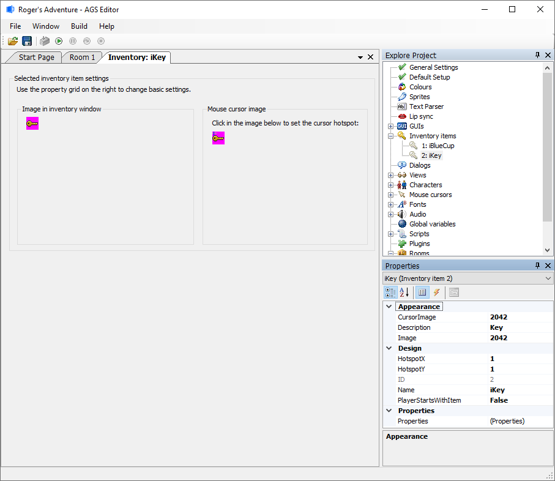
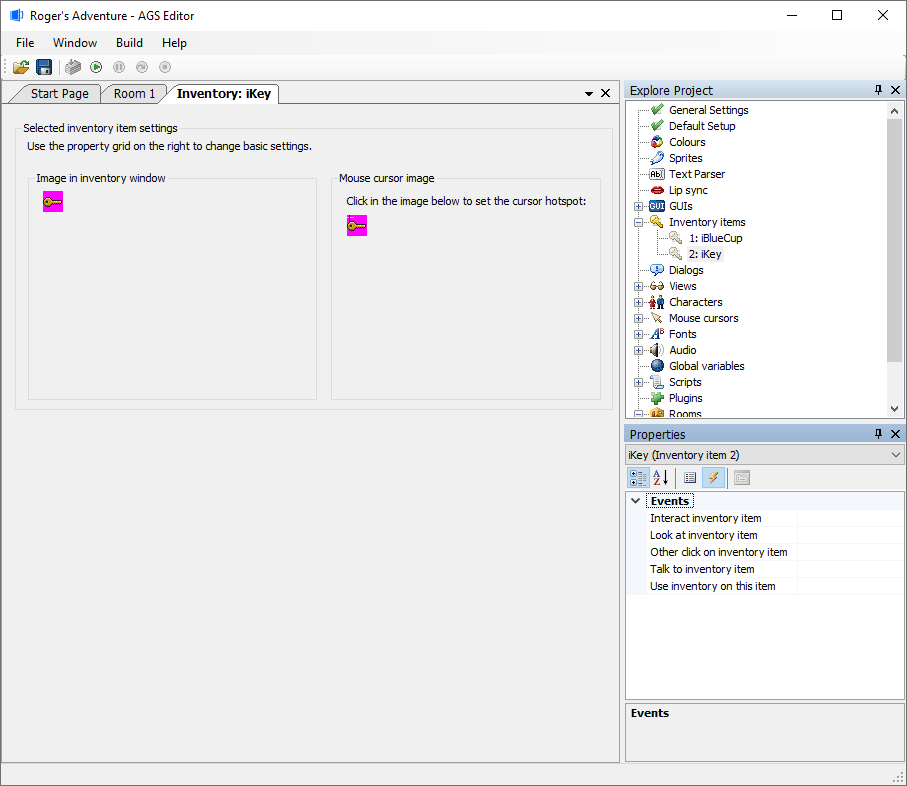
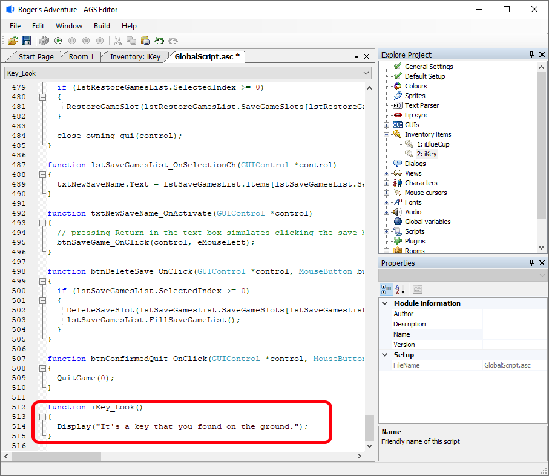

## Getting Started with AGS - Part 5

### Managing Inventory

Each character in the game can carry their own set of inventory items.
Inventory items are totally separate from room objects, and you must
explicitly set up every item which the player can carry at some point in
the game.

Go to the **"Inventory items"** node in the Project Tree. We visited this
briefly in part 4, but it's time to go into a bit more detail.

Every inventory item that the player can carry at some point during the
game is listed in the Project Tree. All the items there also have a
number beside them - this is the _Inventory Item ID_, which is largely for
backwards compatibility with older versions of AGS.

To edit an inventory item, double-click it in the Project Tree, and a
new window will open up with the item's properties in the Properties Grid.
If you want the player character to start off carrying the selected
item, set the "PlayerStartsWithItem" option to True. Remember, if you
want to change which image is used for the item, select the "Image"
property and click the "..." button. There is also a representation of the inventory item as a cursor, as in Sierra-style games. You will read more about that below in the section [Inventory item hotspots](acintro5#inventory-item-hotspots).

Now, you may have noticed that once the player had picked up the key in
our game, they could see it in their inventory window but not actually
do anything to it - clicking "Look" or "Use" on the item did nothing.

In order to give the inventory item some interactivity, we once again
need to call on the Events List. Click the **"Events"** (lightning) button
to bring it up:

Now, the important point to note here is that if you are using the
built-in inventory window (which we are), the only events which can
occur are "Look at inventory item" and "Use inventory on this item".
This is because the default inventory window only has Look and Select
options. The other modes are all available if you design your own
inventory GUI (but that's quite complex so we'll leave it for later).

So, select the "Look at inventory item" event, and click the "..."
button. You'll be taken to the script editor once more, but this time
you'll notice that there's already some existing script as well as our
new method:

We are now editing the *global script*. This has all the script for
handling events on game-wide things like inventory items and characters.
Previously we were working with hotspots and objects, so they were
confined to their own *room script*.

Anyway, for now I've just added a simple _Display_ command to show the
player a message when they look at the key. Feel free to do something
similar.

#### Inventory item hotspots

By default, when the player selects an inventory item as their mouse
cursor and clicks on the screen with it, the center of the item will be
used to decide what to activate. However, with some items you may well
not want this behavior - for example, we might want the end of our key
to be the activation spot.

Back on the selected inventory item tab, To set the cursor hotspot, either click within the "Mouse cursor image" section, or by identifying the "Hotspot X" and "Hotspot Y" within the Properties Grid. (LucasArts-style games rarely used inventory items as cursors.)

##### Mouse Cursor on Inventory Item

Within the games' "General Settings", under "Inventory", there are choices related to using these inventory items as a cursor (usually in Sierra-style games):

1. Inventory item cursor hotspot marker - AGS can automatically add a marker to inventory item cursors to help the player see where the active hotspot is on the cursor. A custom sprite can be chosen, a default crosshair, or none may be selected.
2. Inventory item cursor hotspot marker sprite - If you choose a custom sprite in the choice above, you can define which Sprite # to use here.
3. Use selected inventory graphic for cursor - When true, this will allow the mouse cursor to become the selected inventory item.

#### Recap

-   Inventory items are **not** objects. The two are totally separate,
    although often picking up an object will give the player an
    inventory item.
-   Each character has their own inventory. If you are making a game
    like Day of the Tentacle, where the player can switch between
    characters, then they will each have their own set of inventory
    items. Usually, you'll use inventory commands to operate on the
    current player character.
-   To give the player an inventory item, use the
    `player.AddInventory` command.
-   Test the game as before (F5) , and try it out. Does your character say a comment about the key when you look at the key within your inventory?

## Continue Tutorial

Next Chapter: [Part 6 - Using Your Own Graphics](acintro6)