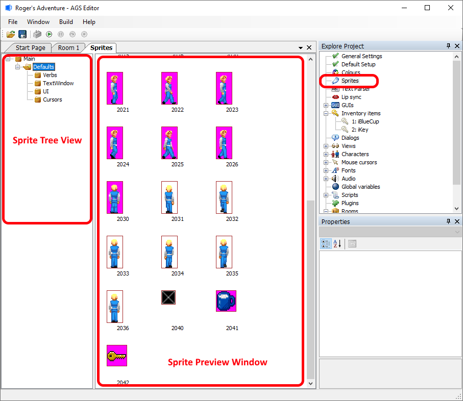
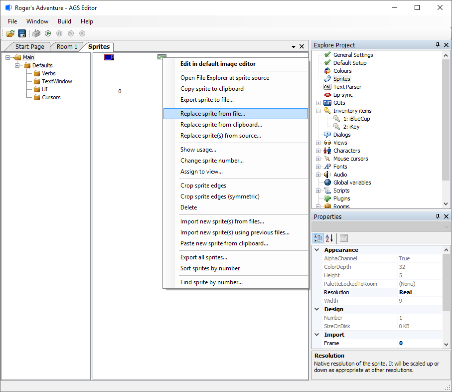

## Getting Started with AGS - Part 6

### Using your own graphics

Although the default Sierra-style template has changed over the years within AGS the images available may not be what you are looking to use. This is no problem, because you can import your own graphics
using the Sprite Manager.

Double-click **"Sprites"** near the top of the Project Tree. This opens up
the _Sprite_ tab (also referred to as the _Sprite Manager_), where you can see the complete sprite set for the
game. There is the "Sprite Tree View" on the left and to the right of that is the "Sprite Preview Window".

AGS uses these sprites for all game graphics, except room backgrounds.
The Sprite Manager is the central place where you do all your graphics
importing. Whenever you want to use images in the game (for mouse
cursors, views, objects, etc.), you select an image to use from here.

 (**NOTE**: You can create and rename folders and sub-folders within the Sprite Tree View (by right-clicking on the existing folders) to better organize your sprites instead of having EVERY sprite of your game within one folder.)

There are three ways to import your graphics; all by right-clicking within the Sprite Preview Window and choosing a context menu choice:
1. **Import a new sprite** -  right-click on the background of the Sprite Preview Window and choose *"Import new sprite from file"*.
2. **Paste new sprite from Clipboard** - If your game is hi-color, you'll have an option to paste from your clipboard memory.
3. **Replace Sprite From File** - Allows you to overwrite an existing sprite with a new one. Perhaps you have finalized graphics to replace a temporary graphic.

 (**NOTE**: The sprite graphics you import should not exceed the maximum
number of colors that the game supports - i.e. if you have a 256-color
game, you must import 256-color sprites.)

#### Import A New Sprite

You may remember that we covered importing a new sprite previously when importing a key image to use as an object on one of our backgrounds in [Tutorial 4 - Import a Sprite](acintro4#import-a-sprite).

#### Replace Sprite From File

The key image we imported back in Tutorial 4 doesn't look so at home in this Space Hub background. So, let's replace that key image with a new key image that looks more alien. Save the following alien key image to your computer. We'll be importing it into AGS Editor in a moment.

* 

Within the Sprite Manager, navigate the "Sprite Tree View" and "Sprite Preview Window" until you can find where you imported the key earlier. Right-click on it and choose **"Replace sprite from file..."**.

Navigate to and select the new alien key image in the dialog box, and then you'll be presented with this:

This is the **Import Sprite** window. You'll see the image from the file
that you chose, along with various options. The **"Zoom"** slider on the right
allows you to zoom in on the image (very useful for low resolution
graphics), and the **"Transparent color"** section options allow you to choose how
AGS decides which color is the image's transparent color. **"Tiled Sprite Import"** will be discussed later in this tutorial.

Now, you have two choices:
* If you want to import the whole image, just
click the **"Import"** button, and you're done.
* If on the other hand you only want to import a portion of the image, then you need to
right-drag the mouse within the image to select the area that you want
to import. You will see a pink grid appear over the image to help you track your selection. (Don't forget, you can zoom in on the image!) Once you've got it, click the **"Import"** button and the
selected area of the image will be imported.

 (**NOTE**: For character graphics, make sure you import graphics that are
a suitable size for the game backgrounds. For example, don't import a
320x200-sized image for your character if your game resolution is 320x200.
A good size for games with this size of screen resolution would be about
20x50 pixels.)

 (**NOTE**: **(256-color only)**: You may well find that the colors on your graphic
look slightly strange once you've imported the image. This is because by
default only the first 41 of the palette colors are allocated to sprites,
so your graphic will be remapped to this much smaller palette. If you find
that many of your imported sprites look strange, you can increase the
number of colors assigned to sprites, at the expense of background colors
(see the earlier part of the tutorial for palette setup).)

#### Tiled sprite import

This feature allows you to import a grid of sprites into separate slots
- for example, if you have several frames of a character animation side
by side in the source bitmap. To do this, simply check the **"Tiled sprite import"** box, and align your rectangle on the top left sprite. When you
click the left mouse button, you will get an extra step which allows you
to size the grid:

Click the left button again once you are happy with the grid. Each of
the cells will be imported as a separate sprite.

 (**NOTE**: Tiled sprite import only works if you selected **"Import new sprite from file"**. If you used the **"Replace sprite"** option, only the first tile will be imported.)

## Continue Tutorial

Next Chapter: [Part 7 - Animations](acintro7)